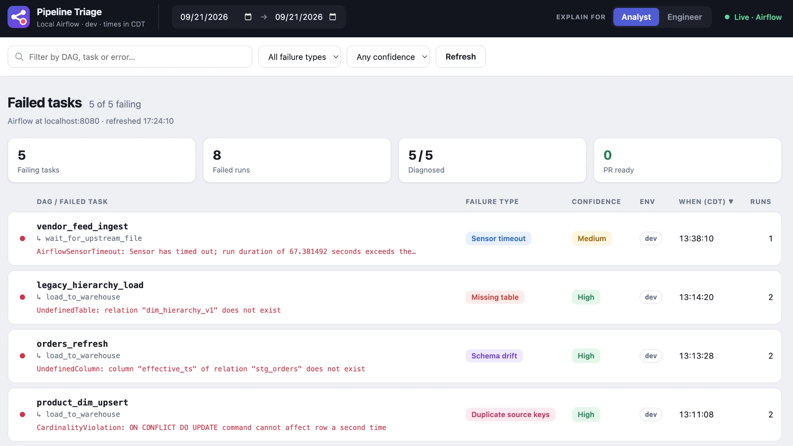
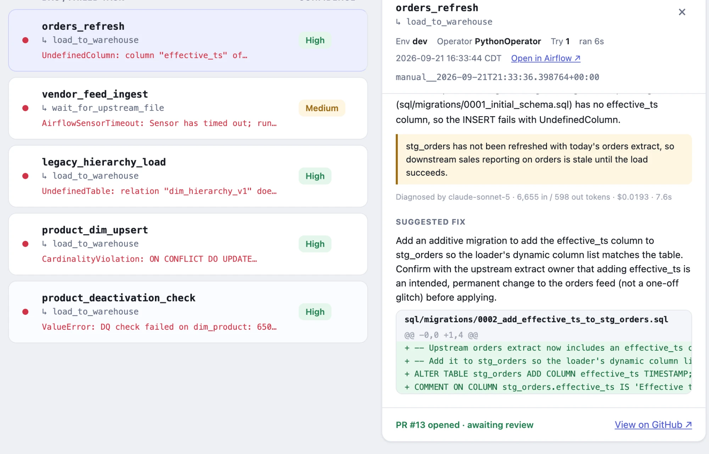
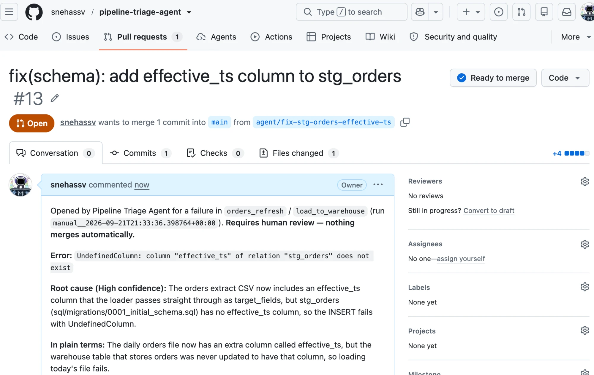

# Pipeline Triage Agent

An LLM-assisted triage tool for Airflow pipeline failures. It reads a failed
task's logs, diagnoses the root cause, explains it in two registers — one for
engineers, one for analysts — and opens a pull request with a suggested fix.
Nothing merges without human approval.

Ships with a local harness that generates realistic pipeline failures, so you
can run the whole thing on your laptop without a cloud account.



---

## Why

A DAG fails overnight. The on-call engineer opens the alert, finds the DAG,
scrolls the logs for the line that matters, cross-references the source in
GitHub, traces upstream tables, writes a fix, opens a PR, and explains to an
analyst why their report is stale. Most of that is mechanical, and most failures
fall into the same handful of shapes.

This compresses "wake up, investigate, diagnose, explain" into "wake up, review,
approve." The judgment stays with the human — the clicking doesn't.

---

## What it does

- **Lists failures** across environments, with filters by environment, date
  range, category, and repository
- **Diagnoses root cause** from the task log via the Anthropic API
- **Explains twice** — an engineer version and an analyst version, toggled in
  the UI, because whoever is on support isn't always someone who reads
  tracebacks
- **Rates its own confidence** (High / Medium / Low) alongside every suggestion
- **Suggests a fix** as a diff against the repository source
- **Opens a pull request** on approval — never merges

### Failure categories it handles

| Category | Example |
|---|---|
| `schema` | Upstream adds a column; the load rejects the batch |
| `merge` | Upsert fails on duplicate business keys in the source |
| `dq` | A data quality threshold is crossed and the pipeline halts |
| `sensor` | An upstream file never lands; the sensor times out |
| `table` | A table was renamed or dropped, or a grant is missing |
| `gcs` | A file doesn't arrive, or an export writes to a bad path |
| `auth` | Token-per-record inefficiency — slow rather than broken |

---

## From failure to pull request

Click a failure and the agent shows its evidence and its reasoning: the task
log, the root cause for engineers or analysts, what the failure affects, and
what the diagnosis cost. Here the orders extract gained a column the warehouse
table doesn't have. The fix is a new additive migration, and because it's High
confidence, rooted in config, and applies cleanly, it can be raised as a PR.



The PR explains itself to whoever reviews it, in both registers, and says
plainly that nothing merges automatically.



---

## Quick start

Requires Docker and an Anthropic API key.

```bash
git clone https://github.com/<you>/pipeline-triage-agent
cd pipeline-triage-agent

cp .env.example .env          # Airflow settings (FERNET_KEY)
docker compose up -d          # Airflow + Postgres warehouse

python scripts/seed_warehouse.py     # schema from sql/migrations + deterministic fake data
```

Unpause the DAGs in the Airflow UI at `localhost:8080`, or trigger failures on
demand:

```bash
python -m scripts.scenarios.inject_duplicate_product_keys
python -m scripts.scenarios.add_column_to_orders_extract
python -m scripts.scenarios.throttle_vendor_api    # the API starts rate-limiting
python -m scripts.scenarios.move_api_endpoint     # the API moves under /v2
python -m scripts.scenarios.reset     # restore the clean seed
```

Then configure and start the agent:

```bash
pip install -r requirements.txt
cp agent/.env.example agent/.env          # add ANTHROPIC_API_KEY (and GITHUB_REPO for PRs)
uvicorn agent.main:app --port 8787        # dashboard: http://localhost:8787
```

The agent reads `agent/.env`, not the root `.env`: docker compose passes the root
file into every Airflow container, and the API key has no business there.

```bash
python -m agent.main                      # today's failures in the terminal
python -m agent.main --usage              # tokens and cost of every diagnosis so far
python -m pytest                          # tests (pip install -r requirements-dev.txt)
```

The dashboard lists every failed task in the chosen date range with its real
exception. Click a row for the task log, the diagnosis (engineer or analyst
view), and the suggested fix. **Raise PR** asks for confirmation and is only
enabled when the fix is High confidence, its patch applies cleanly, and
`GITHUB_REPO` is set — the agent enforces the same rules server-side. Without
`ANTHROPIC_API_KEY` you still get the failures and raw errors, just no diagnosis.

Not every failure should be fixed in code. When the real problem is upstream
data — duplicate keys in a feed, a file that never arrived, a data-quality check
doing its job — the agent says what a person should do instead of proposing a
patch that would hide it.

That isn't left to the prompt alone. Every diagnosis must say where the root cause
lives — `code`, `config`, `data` or `environment` — and the agent refuses a PR for
anything but code or config, whatever the model's confidence. In an early run
Claude rated a duplicate-key failure *High* confidence and proposed a patch that
deduplicated the rows in SQL: the right diagnosis with the wrong remedy, since it
would have hidden the bad feed. The structural rule is what stops that shipping.

Open the dashboard through the agent rather than from disk: the agent injects
the API token when it serves the page, so the HTML file itself holds no secret.

---

## The local harness

The point of the harness is that **every failure is real**. The schema DAG fails
with a genuine driver error, the sensor DAG genuinely times out, the merge DAG
hits a genuine cardinality violation. Synthetic `raise Exception("schema error")`
tracebacks would prove nothing about whether the diagnosis works.

DAGs are generated from config rather than hand-written — eight templates in
`dags/dag_factory.py`, and as many DAGs as you list in
`dags/config/pipelines.yaml`. Add entries to scale up.

### The system the agent can't see

One service in the harness is deliberately opaque. `services/mock_api` stands in for a
third-party API a pipeline depends on, and **its source is never sent to the model** —
the agent gets the DAG that calls it and the task log, exactly as you would for a vendor
system whose code you can't read. A test (`tests/test_mock_api.py`) enforces that.

Two scenarios use it, and both ask a question worth knowing the answer to:

- **`throttle_vendor_api`** — the API starts returning `429` after a handful of requests
  a minute. Nothing in the repository changed, and nothing in the repository fixes it.
  Can the agent tell a pipeline bug from someone else's system misbehaving?
- **`move_api_endpoint`** — the API moves under `/v2` and every DAG that calls it fails
  at once, because each one carries its own copy of `api_base` in `pipelines.yaml`. Does
  the agent reach for the tedious fix (edit every entry) or say the contract changed?

### Schema migrations

The warehouse's tables are defined by numbered files in `sql/migrations/`, and
`python -m scripts.migrate` applies any that haven't run yet (`--status` lists
them). The seed rebuilds the schema through the same runner, so there's one
definition of every table.

This is also where the agent may propose schema fixes. When upstream data
legitimately changes shape — the orders extract gains a column — the fix is a new
migration, raised as a PR like any other change. Migrations are restricted to
**additive DDL**: `CREATE`, `ALTER … ADD`, `COMMENT ON`. No `INSERT`, `UPDATE`,
`DELETE`, `TRUNCATE`, `DROP`, `RENAME` or `CREATE TABLE … AS`, no edits to existing
migrations, and no `CREATE`/`ALTER TABLE` hidden in Python. The rules live in
`scripts/ddl_policy.py` and are enforced twice: the agent won't offer a PR that
breaks them, and the runner won't apply a file that breaks them, whoever wrote it.

Merging a migration PR doesn't touch the warehouse; a person applies it with
`python -m scripts.migrate` after review. Once it's merged, the seed includes it —
so the schema-drift scenario stops failing, which is the point. Remove the
migration locally if you want to reproduce the failure again.

A warehouse created before migrations existed has the tables but no record of
them; rebuild it once with `python -m scripts.scenarios.reset`.

---

## Architecture

```
┌──────────────┐        JSON         ┌──────────────┐
│  Dashboard   │ ◄─────────────────► │   Agent      │
│  (browser)   │                     │  (FastAPI)   │
└──────────────┘                     └──────┬───────┘
                                            │
                    ┌───────────────────────┼───────────────────┐
                    ▼                       ▼                   ▼
              Airflow REST API        Anthropic API          git / gh
              (failed tasks, logs,    (diagnosis + patch)    (git apply --check,
               DAG source)                                    branch + PR)
```

Per failure, the agent (`agent/main.py`):

1. lists failed task instances from Airflow's REST API (`agent/airflow.py`)
2. reduces the task log to the exception, the DAG-code frames, and the lines just
   before the failure
3. collects the DAG's source file and `dags/config/pipelines.yaml`
4. asks Claude for a diagnosis (`agent/diagnosis.py`) — the reply is constrained
   to a JSON schema, and the fix comes back as a git-format patch
5. checks the patch with `git apply --check` against the current checkout

A failed attempt never changes, so all of this is cached per attempt: the
dashboard polls every 30 seconds, but Claude is only called once per new failure.
A diagnosis takes 10–25 seconds, so it never blocks a request — `/failures`
returns the list at once with `"diagnosing": true`, up to four diagnoses run in
parallel in the background, and the dashboard polls every 3 seconds until they land.

The agent returns one object per failure. The two things worth noting in the
shape: `cause` carries both registers as sibling fields, and `confidence` sits
next to the suggested diff rather than being inferred after the fact.

```jsonc
// GET /failures?start=2026-09-21&end=2026-09-21  →  [ ... ]
{
  "id": "orders_refresh::load_to_warehouse",   // stable across polls: dag::task
  "dag": "orders_refresh",
  "task": "load_to_warehouse",
  "run_id": "scheduled__2026-09-21T02:00:00+00:00",
  "day": "2026-09-21", "time": "02:00:07",     // local time (AGENT_TZ)
  "occurrences": 2,                            // failed runs of this task in the window
  "error": "UndefinedColumn: column \"effective_ts\" of relation \"stg_orders\" does not exist",
  "log": [ { "sev": "err", "t": "Task failed with exception" }, ... ],

  "diagnosed": true,
  "diagnosing": false,                         // true while Claude is still working on it
  "type": "Schema drift",
  "cat": "schema",                             // schema|merge|dq|sensor|table|gcs|auth
  "confidence": "High",                        // High|Medium|Low
  "cause": {
    "engineer": "The orders extract gained an effective_ts column ...",
    "analyst":  "Today's orders file has a new column the staging table isn't set up for ..."
  },
  "impact": "stg_orders is stale; downstream order reports show yesterday's data.",
  "rootCause": "config",                       // code|config|data|environment — only code and
                                               // config can ever become a PR
  "fixSummary": "Add effective_ts to stg_orders before the load runs.",
  "patch": "diff --git a/dags/dag_factory.py b/dags/dag_factory.py\n...",
  "patchError": null,                          // git's message if the patch doesn't apply
  "patchWithheld": false,                      // true if a patch came back for a data or
                                               // environment problem: shown, never raised
  "policyError": null,                         // why the patch breaks the migration rules
  "diff": [ { "t": "file|hunk|ctx|add|del", "s": "..." } ],   // the patch, for display
  "prTitle": "fix: add effective_ts to stg_orders",
  "prBranch": "agent/fix-orders-effective-ts",
  "usage": { "model": "claude-sonnet-5", "input_tokens": 3412,
             "output_tokens": 688, "cost_usd": 0.0137, "seconds": 9.4 }
}
```

`POST /pull-requests` takes only `{"id": "..."}`. The patch, branch and title come
from the agent's own diagnosis, so the endpoint can't be used to push arbitrary
content.

---

## Security

This tool can write to a repository and run CLI commands, so it's built with the
posture you'd give any service with production write access:

- **Token header required on every endpoint.** Without it, any local process —
  or a stray browser tab — could trigger real git operations.
- **Schema changes are additive DDL only.** The agent can propose a new migration
  but never data changes or anything destructive, and it never runs SQL against
  the warehouse itself; applying a merged migration is a separate human step.
- **PRs are built from the agent's own diagnosis, never from request content.**
  The caller names a failure; the agent re-checks every gate (High confidence,
  patch applies, valid branch name) and applies the patch with `git apply`, which
  refuses paths outside the checkout.
- **CORS locked to the app's own origin**, so the token can't be read by a page
  on another site.

An agent that writes code and an agent that operates infrastructure are not the
same risk category. This is the second kind.

---

## Limitations

- **Single-turn questions only.** You ask one question about a failure and get
  one answer; there's no conversation thread, so follow-ups lose context.
- **In-memory cache.** Diagnoses are cached per failed attempt, but only for the
  life of the process; a restart re-diagnoses whatever is still in the window.
- **Local credentials.** The agent runs under developer CLI sessions rather than
  a dedicated service account. A production deployment belongs in a container
  with its own scoped credentials.
- **The model is confidently wrong about systems it can't see.** It reasons well
  inside the boundary of the code and logs available to it, and assumes poorly
  outside that boundary. This is why nothing merges without review.

---

## Roadmap

- [ ] Conversational thread per failure
- [x] Diagnosis caching
- [ ] Persist diagnoses across restarts
- [ ] Containerized deployment with a scoped service account
- [ ] Additional failure categories

---

## License

MIT
